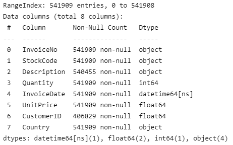
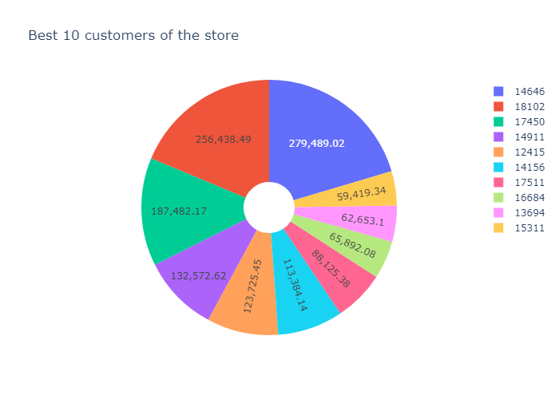
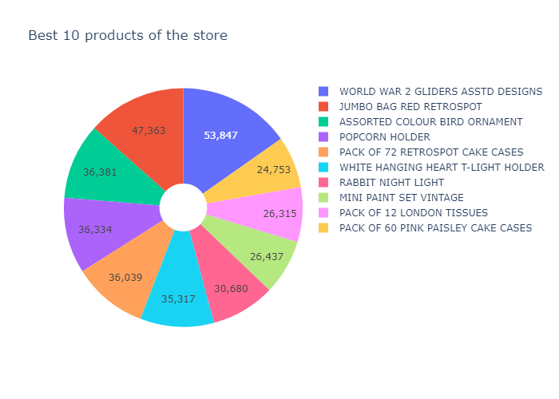
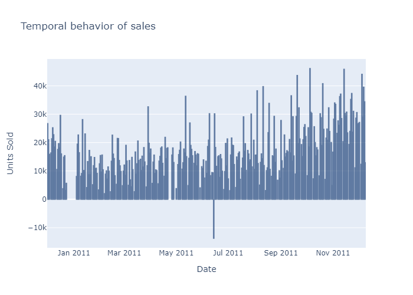
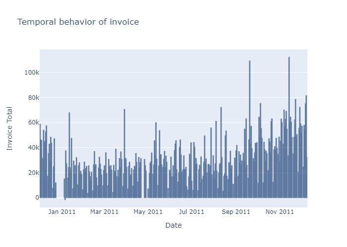
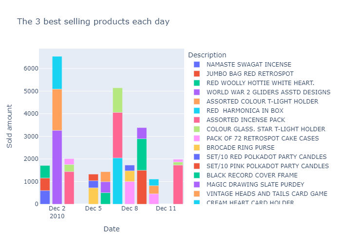
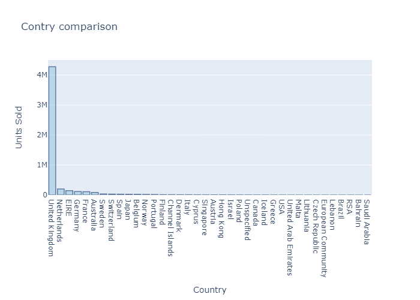
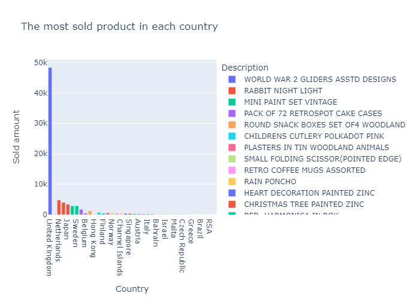
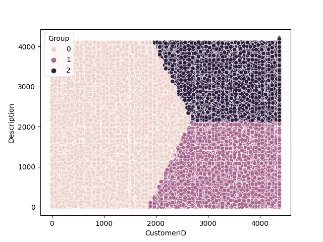

# Desafio Técnico - Cinnecta
A seguir, está documentado todo o pipeline para a resolução do desafio técnico proposto para a vaga de Data Engineer, da Cinnecta, realizado pelo candidato João Victor Magalhães Souza.
## Sumário
- [Exploratory Data Analisys (EDA) e Data Treatment](#exploratory-data-analisys-eda-e-data-treatment)
- [Questão 1](#questão-1)
  - [a)](#a)
  - [b)](#b)
  - [c)](#c)
  - [d)](#d)
- [Questão 2](#questão-2)
- [Como executar](#como-executar)

## Exploratory Data Analisys (EDA) e Data Treatment
A primeira coisa que fiz foi analisar, sem muitos detalhes, a estrutura geral dos dados fornecidos. Como vi que haviam mais features categóricas que contínuas, eu decidi analisar então a quantidade de informações ausentes nos dados:
 

 
Como podemos observar, há alguns valores ausentes nas colunas "Description" e "CustomerID", ou seja, existem vendas cujo não se sabe quem é o comprador e vendas que não se sabe o que foi comprado, ambos casos sendo um problema.
Notei então que todos os produtos que não possuem Descrição também não possuem o ID do Cliente comprador e seu preço unitário é 0, ou seja, é informação irrelevante, que não apresenta uma semântica que possa ser útil na nossa análise e, sendo assim, decidi remover esses registros.

Outra questão que pude observar é que algumas vendas possuem produtos com preço negativo (<0). Como não tenho uma noção mais específica do negócio (mais informações sobre os dados/variáveis), eu decidi remover esses registros visto que, comumente, a ocorrência de preços negativos não faz sentido.

Observei também que algumas transações possuem produtos com Quantidade comprada negativa. Neste caso, ao invés de removê-los, decidi considerar essas ocorrências como sendo uma devolução de tais produtos e, sendo assim, mantive esses registros.

Por fim, para facilitar as análises, alterei os valores ausentes dos Clientes (em CustomerID) para "Unknown". Após esses processos, já podemos começar a obter insights úteis dos dados.

## Questão 1
### <strong>a)</strong>
Interpretei como melhor cliente aquele que traz mais dinheiro para a loja, ou seja, se tenho uma compra de X unidades e cada unidade custa Y, então preciso analisar o resultado de X*Y, pois nos fornecerá o total pago pela transação. Dessa forma, precisei criar uma nova variável que calcula esse total pago em cada transação. Depois, bastou agrupar os clientes e somar o quanto cada cliente trouxe para a loja no período de dados disponibilizado. Nesta análise, o melhor cliente encontrado foi "Unknown", visto que, os resultados mostram que as compras sem um cliente associado somaram o maior capital resultante. Entretanto, no gráfico abaixo são mostrados os 10 melhores clientes da loja que possuem um ID associado:
 

 
Com este gráfico, é possível visualizar o total comprado por cada um desses melhores clientes (não é sabido se é em dólar, euro, real ou qualquer moeda). Em suma, por exemplo, o cliente "14646"(em azul) é o cliente que mais trouxe capital para a loja, e o cliente "15311"(em amarelo) é o 10º cliente que mais trouxe capital.

### <strong>b)</strong>
Como os melhores produtos, penso que são aqueles que foram mais vendidos no período analisado. Para descobrir isso então, já que em cada transação temos o número de unidades vendidas de determinado produto, basta agrupar os produtos e somar o valor de unidades vendidas em todas as transações de cada produto. 
 

 
A figura acima mostra que o produto mais vendido da loja no período analisado é "Wolrd War 2 Gliders Asstd Designs" com 53847 unidades vendidas.

### <strong>c)</strong>
Para ter noção do comportamento diário, temos uma variável que mostra a data e hora de cada transação. Como é queremos ter noção do comportamento diário, a hora não é relevante e, devido a esse motivo, o primeiro ajuste que fiz foi retirar dos dados essa informação acerca das horas, minutos e segundos em que a transação ocorreu. 
#### <strong>Volume</strong>
O volume de vendas foi entendido como o total de produtos vendidos em cada dia durante o período analisado. Para isso, agrupei os registros por dia e por produto e realizamos a soma da quantidade de unidades vendidas em cada dia de cada um dos produtos vendidos naquele dia. Dessa forma, conseguimos analisar tranquilamente o comporamento volumétrico das vendas. Abaixo, é mostrado um gráfico com todos os dias:
 

 
Podemos notar que houve um dia, no período entre Jun/2011 e Jul/2011 que houveram mais devoluções que aquisições, explicando o valor negativo obtido. Além disso, fica claro uma maior aquisição e maior consistência no período de Nov/2011, possivelmente por conta da famosa Black Friday e as promoções que circundam o mês de Novembro e fim de ano.

#### <strong>Faturamento</strong>
Em termos de faturamento, o pensamento é similar ao anterior, mas agora ao invés de olharmos somente a Quantidade, olhamos a relação Quantidade * Preço, que nos mostrará o Faturamento:
 

 
É notório que o período após Set/2011 apresenta uma consistência de faturamento em maior nível que os períodos anteriores, que pode ser possivelmente explicado pelas promoções de fim de ano, como dito anteriormente.

#### <strong>Produtos Vendidos</strong>
Nesta análise, busquei quais foram os três produtos mais vendidos em cada dia. Para tal, calculei o total vendido por cada produto em um dia e peguei apenas os três mais vendidos. Abaixo, mostrarei apenas alguns dias visto o grande período de análise:
 

 
Para uma eventual análise mais detalhada, recomendo a utilização do Jupyter no VSCode para analisar os gráficos plotly interativos. 

### <strong>d)</strong>
Na análise dos países, realizei duas abordagens: a primeira delas mostra um comparativo geral dos países em termos do número total de unidades compradas:
 

 
Podemos observar claramente que o Reino Unido detém, tranquilamente, o maior número de clientes da referida loja, seguido da Holanda, Irlanda e Alemanha. Já o país com o menor número de transações é a Arábia Saudita.

A segunda análise explora qual o produto mais consumido por cada país:
 

 

## Questão 2
Na tentativa de segmentar as transações buscando possíveis clientes com aquisições semelhantes, logo pensei em utilizar um modelo de aprendizado não supervisionado denominado KMeans. Mesmo com poucas features de entrada que possam me dizer sobre o Cliente, senti que podeira conseguir clusters que me mostrassem algum insight útil. Dessa forma, construi um modelo que iria agrupar os dados em 3 grupos (como pedido no enunciado) e, após agrupado, eu poderia observar características desses grupos e expandir essa análise para o conjunto de dados como um todo para ver se tal análise era válida ou não:
 

 
O gráfico acima mostra os grupos criados pelo KMeans: podemos ver que Clientes possuem compras (Description está encodado) e o KMeans conseguiu criar relações interessantes que consegui explorar e direi posteriormente.

### <strong>Grupo 0 - Cake Customers</strong>
Analisando os clientes do Grupo 0 e suas transações, pude observar diversas transações ligadas a produtos relacionados a palavra CAKE (bolo). Investigando no conjunto de dados após o tratamento, vi que 61% dos consumidores estão interessados em produtos relacionados ao segmento de bolos. Logo, esse segmento seria a minha primeira indicação ao Marketing.

### <strong>Grupo 1 - Bag Customers</strong>
Observando os Clientes do Grupo 1, bem como as suas respectivas compras, notei que uma ampla gama de clientes <strong>distintos</strong> tinha interesse em produtos relacionados à BAGs (bolsas). Então, para ver se esse interesse era generalizável, fui olhar em todos os dados (não somente do Grupo 0) e ver quantos clientes tinham interesse pelo segmento de BAGs e vi que 58% dos compradores tinham interesse neste segmento. Portanto, outra sugestão ao Marketing seria no segmento de bolsas.

### <strong>Grupo 2 - Clock Customers</strong>
Por fim, o último segmento encontrado foi para consumidores interssados em relógios e derivados (CLOCK). Temos que 21% dos clientes estão interessados neste segmento, fechando a lista da minha indicação ao time de Marketing.

<strong>Observações Importantes:</strong> No arquivo "data_intelligence.py" que dediquei para fazer essa análise não será encontrado a minha investigação detalhada sobre cada grupo, visto que esse processo foi bem empírico/experimental. Além disso, destaco que o modelo KMeans trabalhou apenas com as features CustomerID, Description e Country. Para essa análise, os resultados foram extremamente satisfatórios visto que, em tese, "só sei o que o cliente comprou e de onde comprou". Geralmente esses modelos funcionam melhor com mais variáveis preditoras.

## Como executar
Para executar a solução, primeiro recomendo ter o Python 3.8.5 instalado, bem como adquirir as bibliotecas necessárias contidas no arquivo "dependencies.txt".
Após isso, para visualizar os gráficos interativos, sobretudo os artefatos desenvolvidos, recomendo utilizar o Jupyter no VSCode, executando o arquivo "main.py". 